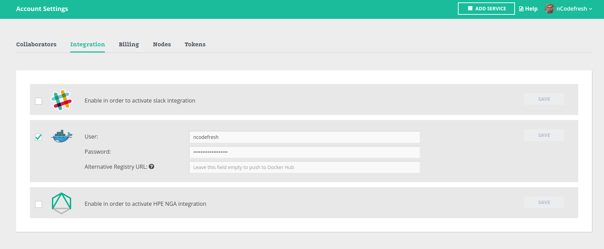
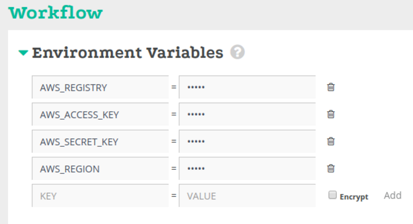

# Welcome

So, you've decided to try Codefresh? Welcome on board!

Using this repository we'll help you get up to speed with basic functionality such as: *building Docker images* and *pushing*.

This project uses `Node JS` to build an application which will eventually become a distributable Docker image.

## Looking around

In the root of this repository you'll find a file named `codefresh.yml`, this is our [build descriptor](https://docs.codefresh.io/docs/what-is-the-codefresh-yaml) and it describes the different steps that comprise our process.
Let's quickly review the contents of this file:

### Building

To bake our application into a Docker image we use Codefresh's [Build step](https://docs.codefresh.io/docs/steps#section-build).

The Build is a simplified abstraction over the Docker build command.

```yml
build_image:
    title: Building Image
    type: build
    #Important: rename this image to to a valid repository in your registry. For example: myUserName/vote
    image_name: codefresh/example-build-push
    #Dockerfile location should be relative to the working directory
    dockerfile: Dockerfile
```

Use the `image_name` field to declare the name of the resulting image (don't forget to change the image owner name from `codefreshdemo` to your own!).

### Pushing

To push Docker image to docker registries we use Codefresh's [Push step](https://docs.codefresh.io/docs/steps#section-push).

If you provided the credentials to Docker registry on integration page you can use following step to push the image

```yml
push_to_registry:
    title: Pushing to Docker Registry
    type: push

    #A candidate is the image that we want to push to registry
    candidate: '${{build_image}}'

    # You can push the image with whatever tag you want. In our example we use CF_BRANCH, which is a variable in
    # the build process, accessible throughout the entire flow.
    tag: '${{CF_BRANCH}}'
```



In case if you want to provide docker registry credentials in codefresh.yml you can look at this step

```yml
push_to_registry:
    title: Pushing to Docker Registry
    type: push

    #A candidate is the image that we want to push to registry
    candidate: '${{build_image}}'
    registry: # your registry url
    credentials:
        username: ${{USERNAME}}
        password: ${{PASSWORD}}
    # You can push the image with whatever tag you want. In our example we use CF_BRANCH, which is a variable in
    # the build process, accessible throughout the entire flow.
    tag: '${{CF_BRANCH}}'
```

If you want to push your image to Amazon EC2 Container Registry you can use the following properties of git-clone step

### Push your image to AWS-ECR
#### Requirements:
  * registry url
  * accessKeyId
  * secretAccessKey
  * region

#### How-to get the requirements
- Go to [Amazon console](https://console.aws.amazon.com/console/home)
- Open `EC2 Container Service`
- Open `Respositories` and create new one, in our case `codefresh/example-image-aws-ecr`
- Create
- Get the repository url and the region
- Get the `accessKeyId` and the `secretAccessKey` from the console settings


####Configuration in Codefresh:
We assume you already forked this repo and create a service for it
- In `./codefresh.aws.ecr.example.yml` change `build_step` config
  - `image_name` should be the new name of your repository.
  - Push your change
- Open the service and add new pipeline
- Switch to `Use YML build`
- Change the `YML File Location` to be `./codefresh.aws.ecr.example.yml`
- Under Environment variables fill the next variables:
  - `AWS_REGISTRY` to be the registry url (note that the url already have the repository name)
  - `AWS_ACCESS_KEY` your access key id
  - `AWS_SECRET_KEY` your secret key
  - `AWS_REGION` the region of your registry


```yml
push_to_aws_ecr:
    type: push
    description: Free text description
    candidate: ${{build_step}}
    tag: ${{CF_BRANCH}}
    provider: 'ecr'
    registry: ${{AWS_REGISTRY}}
    accessKeyId: ${{AWS_ACCESS_KEY}}
    secretAccessKey: ${{AWS_SECRET_KEY}}
    region: ${{AWS_REGION}}
```



## Using This Example

To use this example:

* Fork this repository to your own [INSERT_SCM_SYSTEM (git, bitbucket)] account.
* Log in to Codefresh using your [INSERT_SCM_SYSTEM (git, bitbucket)] account.
* Click the `Add Service` button.
* Select the forked repository.
* Select the `I have a Codefresh.yml file` option.
* Complete the wizard.
* Rejoice!
